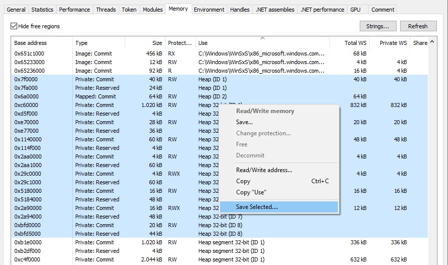
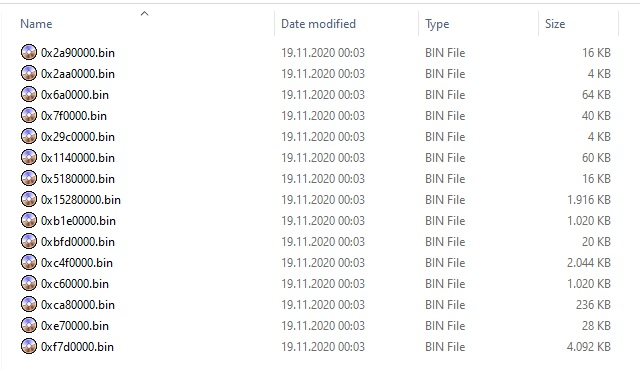

# MultiFileMemSavePlugin
plugin for Process Hacker 2 to save multiple memory regions in separate files in just a couple of clicks

[DOWNLOAD](https://github.com/yokrysty/MultiFileMemSavePlugin/releases/latest)

 

**Compiling requirements:**

- Windows SDK 10.0.15063.0
- Process Hacker 2 SDK:
  - developed using version 2.39
  - included in ph_sdk folder
- Visual Studio 2019
